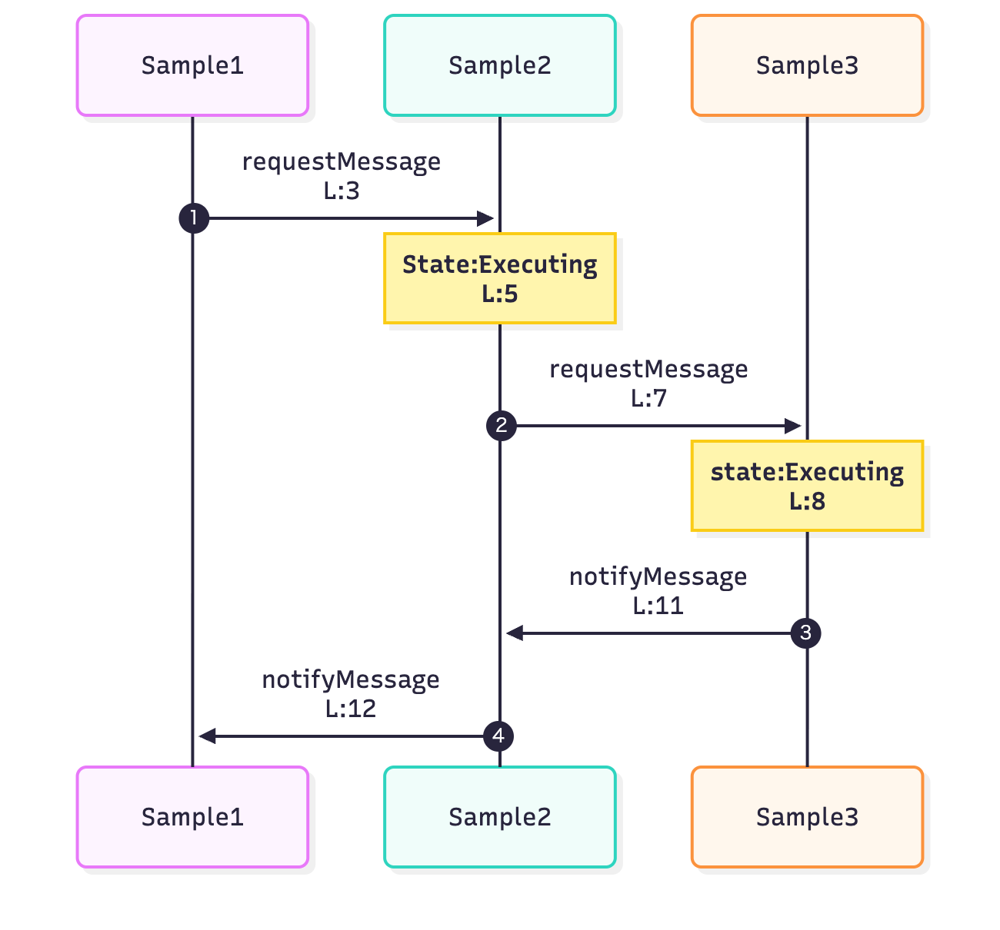

log2mermaid
=================

A tool that converts logs into Mermaid sequence diagrams.

Quick start

1. Install Python 3
2. Run the command below
```sh
python3 log2mermaid.py LOG_FILE MATCH_CSV > diagram.mmd
```

Sample

- Samples are in the `example` directory.



CSV format

- Required columns: `title`, `match`, `src`, `dst`
- Optional column: `kind`
  - If `kind` is `note`, that row is treated as a "note row".
  - Note rows represent various events such as state changes. No `src -> dst` message is emitted; instead, a Mermaid Note is shown over the lifelines.
  - If `kind` is omitted or not `note`, the row is treated as a normal message (arrow).
- `match` is a regular expression (Python `re.search`) applied to each log line.
- Example (excerpt from `example/match.csv`):

  | title          | match                        | src     | dst     | kind    |
  | ----           | ----                         | ----    | ----    | ----    |
  | requestMessage | Sample1 .* requestMessage    | Sample1 | Sample2 | message |
  | notifyMessage  | Sample2 .* notifyMessage     | Sample2 | Sample1 | message |
  | State:Executing| Sample2 State:.* -> 1        | Sample2 |         | note    |

Japanese guide

- See `README.ja.md`.
